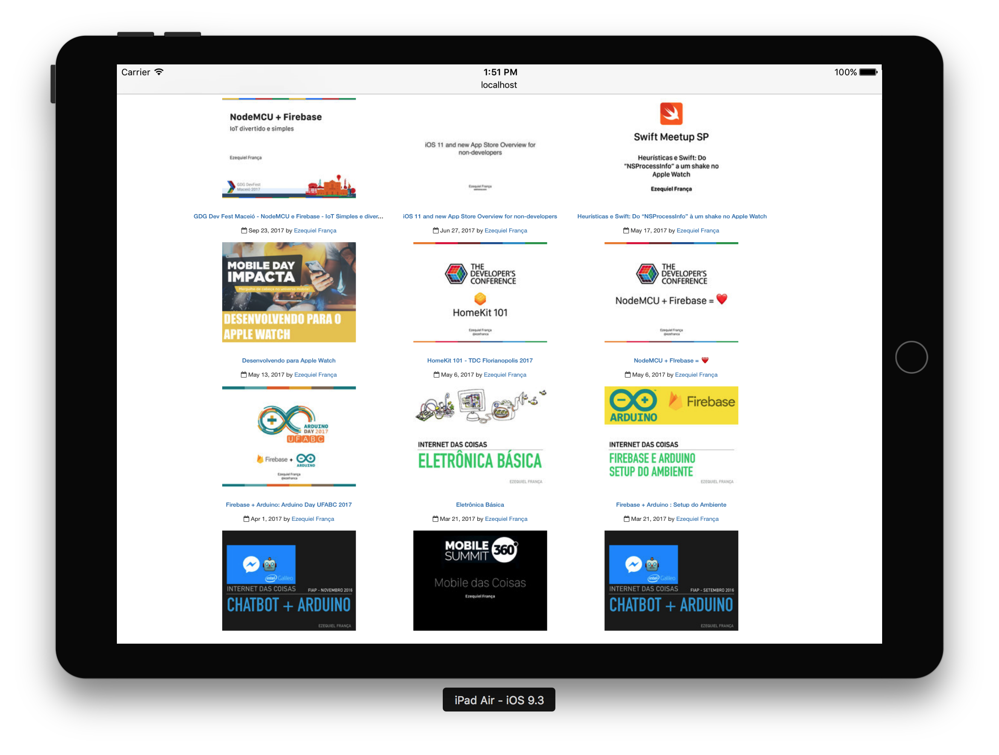

<p align="center"> 

<p> A very simple Speaker Deck Widget to show yours last talks. Just two html lines. Based on <a href="https://github.com/jcouyang/">@jcouyang</a>, <a href="https://github.com/jcouyang/gh-widget">
Github Widget</a>

</p>
</p>

```html
    <div id="speakerdeck-widget" data-sp_username="speakerdeck-username" data-display="talks"></div>
    <script src="http://ezefranca.com/speakerdeck-widget/index.js"></script>
```
<h3>Try it :)</h3>



## Config
- username: put your Speaker Deck username in `sp-username` attribute
- display: for now, use `talks`

## Try
<p>Go to <b>https://ezefranca.com/speakerdeck-widget/your-speaker-deck-username</b> and see how your widget looks</p>

## Live Example
- http://ezefranca.com/widget.html

## How this works
The same way of <a href="https://github.com/jcouyang/gh-widget">gh-widget</a> works. A simple hosted gist get the data from speakerdeck site, and index.js parse and build the widget.

